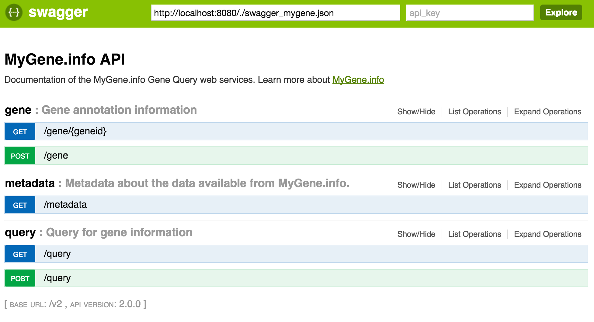

# MyGene Swagger Specification
Swagger specification of MyGene.info web services.

The swagger.json file can be used with the [Swagger-UI project](http://swagger.io/swagger-ui/), available on GitHub. 

## Installation of Swagger-UI
* Download Swagger-UI project
* Run `npm install`
* Change the file index.html (src/main/html/index.html) and replace 
the URL for the Pet Store swagger.json file for your swagger.json file.
* Run `gulp` to build the project
* Run `gulp serve` to launch the web site locally
* The folder `dist` contains the files to deploy the app to a server.

## Output
Using the swagger.json file documenting web services for MyGene.info will generate a site as below.

